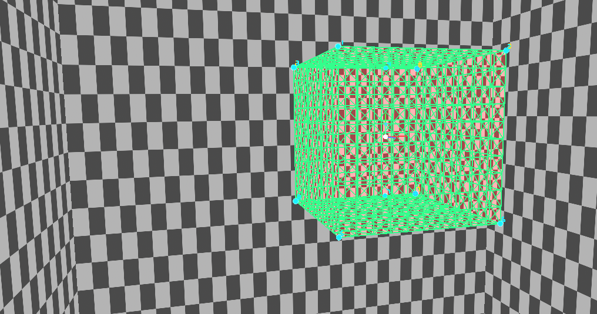

# PolychaseTracker

A Nuke 17 (NDK) mesh-based motion tracker. Given footage, a camera and a 3D
mesh that matches an object in the shot, it solves the object's (or camera's)
motion from a prebuilt Polychase optical-flow database and exports an animated
Camera or TransformGeo.

The optical-flow database is built **outside** Nuke (by Motion2DB); 
this node only reads a prebuilt `.db` and solves.



## Inputs

| Pin | Accepts | Purpose |
|---|---|---|
| `img` | Read / plate | Footage frames |
| `cam` | Camera | Intrinsics (focal, aperture) |
| `geo` | Geo / mesh | The 3D mesh to track |
| `mask` | (optional) | Region mask |

All inputs are optional and type-gated — Nuke greys out wires that don't match.

## Workflow

1. Connect `img` + `cam` + `geo`.
2. Set the **Database** path to the `.db` built by Motion2DB.
3. On the **first frame**, place pins in the Viewer and key the pose.
4. Click **Track Forward** (or **Track Backwards**) to solve from that pose.
5. Pick a **Solve Mode** (Camera or Model) and click **Export** to spawn an
   animated Camera2 or TransformGeo carrying the tracked motion.

## Handy controls

- **Pins** — place, remove, and key pins to anchor the mesh to the plate;
  refine ranges with anchors.
- **Solve Focal (P4Pf)** / **Smooth Solved Focal** / **Copy Solved Focal → Camera**
  for focal-length solving.
- **Load Tracks** / **Connect** to drive the solve from a Nuke Tracker4 node's 2D tracks.
- Inspect the flow database itself with **VisualizeFlowDB**.

### Viewer hotkeys

| Key | Action |
|---|---|
| `shift+P` | Toggle Pin Edit |
| `ctrl+Z` | Undo Move (the tracker's own move history) |
| `ctrl+shift+Z` | Redo Move |

The move history is independent of Nuke's undo stack — gizmo moves, pin edits
and wireframe-colour changes all undo/redo through it while a PolychaseTracker
is the active node.

## Install

After building (see [`BUILDING.md`](../../001_PolychaseTracker_V1.0.0/BUILDING.md)),
add the plugin path to your `~/.nuke/init.py`:

```python
import nuke
nuke.pluginAddPath('/path/to/PolychaseTracker/plugin')
```

Then create it from the **Polychase → PolychaseTracker (NDK)** menu.

## Build (summary)

```bash
./build.sh
```

A successful build produces `build/PolychaseTracker.so`. The full reference —
prerequisites (Nuke 17, gcc-toolset-13, CMake/Ninja, a built Polychase tree),
the machine-specific paths to change, and all build toggles — is in
[`BUILDING.md`](../../001_PolychaseTracker_V1.0.0/BUILDING.md).

---

GPL-3.0-or-later · © 2026 Peter Mercell
