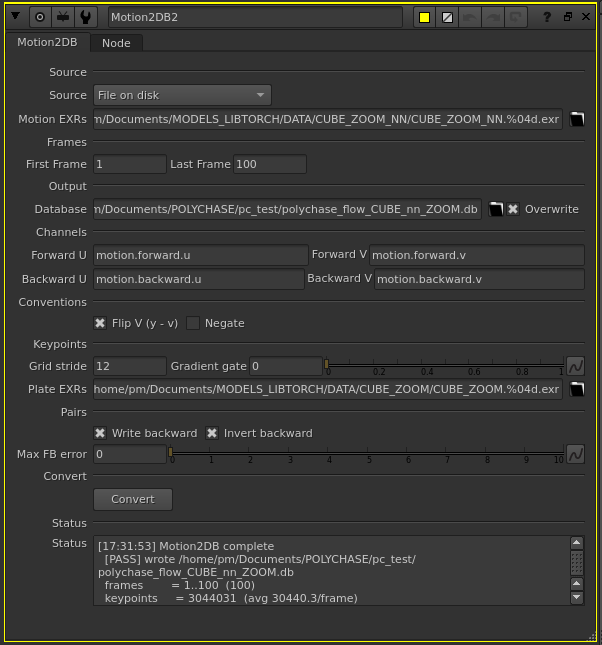

# Motion2DB

A Nuke (NDK) node that builds a Polychase optical-flow database (`.db`) from a
pre-rendered motion-vector EXR sequence on disk.

Point it at a motion-vector sequence (the `motion` layer: `forward.u/v` +
`backward.u/v`), set the frame range and an output `.db`, and press **Convert**.
The resulting database drives **PolychaseTracker** and can be inspected with
**VisualizeFlowDB**.



## Why it works this way

Motion2DB is a no-input, button-driven node. It reads the motion EXRs
frame-by-frame straight from disk with TinyEXR, so there is **no Nuke
frame-stepping** involved — that avoids the rendering bug that broke in-node
analysis. It resamples the dense flow at a grid of keypoints and writes the
exact records PolychaseTracker reads.

## Usage

1. Add a **Motion2DB** node (no input connection needed).
2. **Motion EXRs** — path to your motion-vector sequence (`…/motion.####.exr`).
3. **First / Last Frame** — the frame range to convert. These become the
   1-based image IDs in the database.
4. **Database** — the output `.db` path. Enable **Overwrite** to replace an
   existing file.
5. Press **Convert** and watch the **Status** line for results.

## Knobs

| Section | Knob | Purpose |
|---|---|---|
| Channels | Forward U/V, Backward U/V | Channel names for the flow layer (defaults match the `motion.*` convention). |
| Conventions | Flip V (y − v) | Write top-origin DB coordinates. On by default. |
| Conventions | Negate | Flip flow direction ("came-from" vs "goes-to"). |
| Keypoints | Grid stride | Spacing of the keypoint grid (default 12 px). |
| Keypoints | Gradient gate | Skip grid points below this luma gradient. |
| Keypoints | Plate EXRs | Optional plate sequence used for the gradient gate. |
| Pairs | Write backward | Also write backward correspondences. |
| Pairs | Invert backward | Backward pairs = exact inverse of forward. |
| Pairs | Max FB error | Drop correspondences above this forward/backward error (0 = off). |

## Build

```bash
rm -rf build
cmake -S . -B build -G Ninja \
  -DCMAKE_CXX_COMPILER=$(scl enable gcc-toolset-13 'which g++')
cmake --build build -j
```

Verify the linked library:

```bash
ldd ./Motion2DB.so
readelf -d Motion2DB.so | grep NEEDED
```

## Third-party

Motion2DB reads EXR frames with **TinyEXR** by Syoyo Fujita and contributors.
See [`LICENSE-TinyEXR.txt`](LICENSE-TinyEXR.txt) for its BSD 3-Clause license
(it also bundles OpenEXR code under a BSD 3-Clause license).

---

GPL-3.0-or-later · © 2026 Peter Mercell
