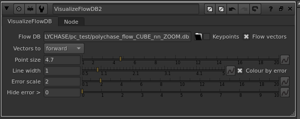
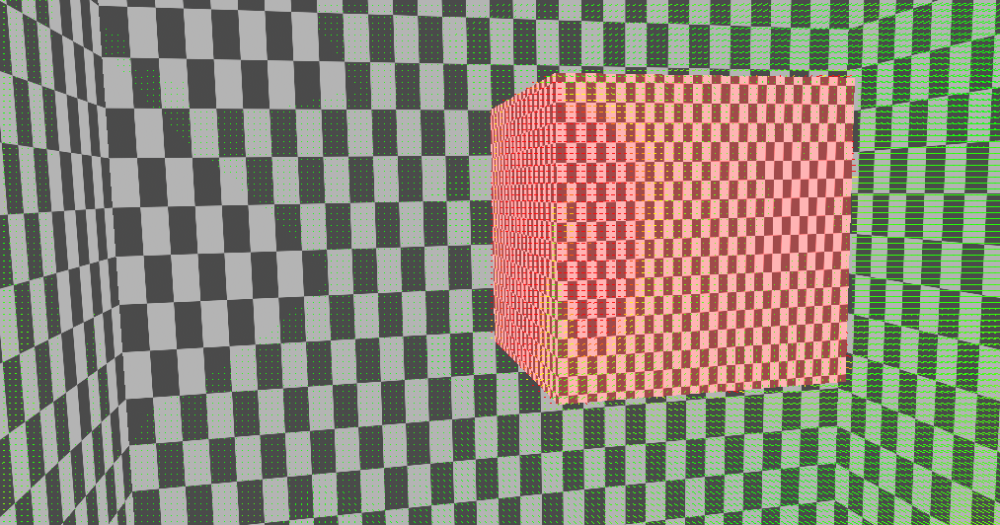

# VisualizeFlowDB

A Nuke (NDK) node that overlays a Polychase optical-flow database (`.db`) on top
of your plate in the 2D viewer — pure inspection, no tracking and no solve. It is
the in-viewer cousin of Polychase's `visualize_flow.cc`.

Wire your footage into input 0, set the **Flow DB** path, and scrub the timeline
to inspect keypoints and per-frame flow vectors.



The overlay draws a dot at each keypoint on the current frame and a line from
each keypoint to where it flows in the neighbouring frame(s).



## Usage

1. Add a **VisualizeFlowDB** node and connect your plate to input 0 (`img`).
2. **Flow DB** — path to the `.db` produced by Motion2DB / Analyze.
3. Scrub to any frame to see the keypoints and vectors for it.

## Knobs

| Knob | Purpose |
|---|---|
| Keypoints | Show/hide the keypoint dots. |
| Flow vectors | Show/hide the flow lines. |
| Vectors to | Direction to draw: forward, backward, or both. |
| Point size | Size of the keypoint dots. |
| Line width | Width of the flow vectors. |
| Colour by error | Tint vectors by match error instead of a flat colour. |
| Error scale | Error value mapped to full red. |
| Hide error > | Hide vectors with error above this threshold (0 = off). |

The database stores real-pixel, top-origin keypoints; the node flips Y to the
viewer's bottom-origin space at draw time, so the overlay lines up with the
plate. Per-frame geometry is cached so panning and zooming don't re-query SQLite.

## Build

```bash
cmake -S . -B build \
  -DNUKE_VERSION=17.0v1 \
  -DPOLYCHASE_ROOT=$HOME/Documents/POLYCHASE/polychase
cmake --build build -j
```

---

GPL-3.0-or-later · © 2026 Peter Mercell
